# Data Science Projects

# 📊 Project 1 — Dynamic Temperature & Velocity Analysis in Engineering Systems

## 🔍 Overview
This project applies **data science, exploratory data analysis (EDA), and predictive modeling** to analyze **thermal and fluid dynamic behavior** in two critical engineering systems:

- **Heat Exchangers**
- **Chemical Reactors**

By combining **physics-based simulation**, **statistical summaries**, and **predictive trend analysis**, the project demonstrates how data science can be used to **monitor system stability**, **detect deviations**, and **support operational decision-making** in industrial environments.

---

## 🎯 Objectives
- Model **temperature distribution** across time and space  
- Analyze **dynamic temperature control** in a reactor  
- Perform **EDA across multiple physical systems**  
- Compare **observed vs predicted velocity profiles**  
- Evaluate **prediction accuracy for reactor temperature**

---

## 🧪 System 1 — Heat Exchanger Temperature Distribution
This visualization shows how temperature evolves over **time** and **distance** inside a heat exchanger.

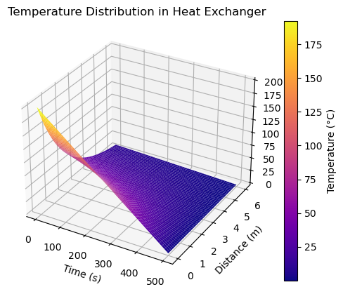

### Key Insights
- Temperature decays with both **time** and **axial distance**
- Highlights **thermal efficiency loss**
- Useful for detecting **ineffective heat transfer zones**

---

## 🔥 System 2 — Dynamic Temperature Control in a Chemical Reactor
A spatio-temporal view of temperature regulation inside a reactor.

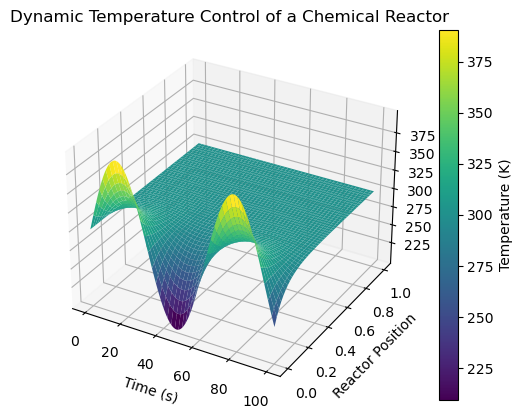

### Key Insights
- Oscillatory behavior indicates **active control dynamics**
- Spatial damping shows **heat dissipation stability**
- Applicable to **process control and safety monitoring**

---

## 📈 Exploratory Data Analysis (EDA) Across Systems
Summary statistics across three subsystems:
- Reactor Temperature
- Pipe Velocity
- Heat Exchanger Temperature
  

### Metrics Analyzed
- Minimum
- Maximum
- Mean
- Standard Deviation

### Why It Matters
- Identifies **variability and risk**
- Supports **threshold setting**
- Enables **cross-system comparison**

---

## 🚰 Pipe Flow Analysis — Velocity vs Radius
Observed vs predicted velocity distribution along pipe radius.

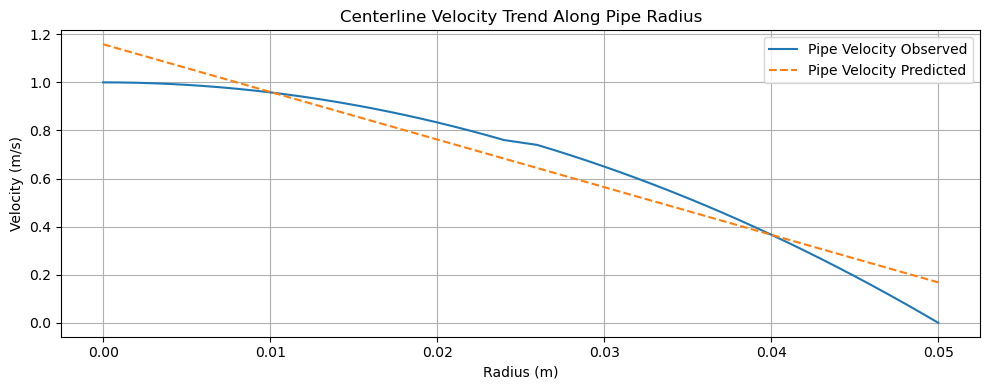

### Key Insights
- Near-parabolic profile consistent with **laminar flow**
- Prediction deviation near pipe wall highlights **model limitations**
- Useful for **hydraulic efficiency validation**
---

## 🤖 Predictive Modeling — Reactor Mid-Position Temperature
Comparison between observed and predicted reactor temperature over time.

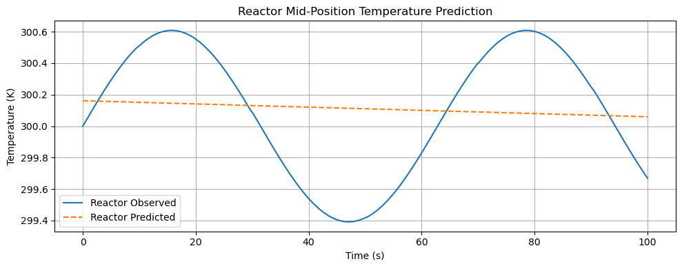

### Key Insights
- Model captures **trend but smooths oscillations**
- Demonstrates bias–variance tradeoff
- Foundation for **advanced ML control models**

---

## 🧠 Data Science Techniques Used
- Exploratory Data Analysis (EDA)
- Time-series trend analysis
- Physics-informed simulation
- Model vs observation comparison
- Visualization with Matplotlib & NumPy

---

## 🛠 Tools & Technologies
- Python
- NumPy
- Matplotlib
- Jupyter Notebook
- Statistical Analysis
- Engineering Modeling

📂 Notebook:

Heat Exchangers vs. Reactors – The Role of Dynamic Temperature & Fluid Velocity Profiles.ipynb

---

## 🚀 Applications
- Process Engineering
- Chemical & Thermal Systems
- Manufacturing Optimization
- Predictive Maintenance
- Data-Driven Engineering Decisions

---

## ⭐ Why This Project Matters
This project demonstrates how **data science bridges theory and real-world engineering systems**, enabling:
- Better control
- Higher efficiency
- Safer operations
- Smarter decision-making
  
---

# 📊 Project 2: Photolithography Yield Risk Prediction  
## AI-Driven Pass/Fail Modeling for Semiconductor Manufacturing

> **Project Type:** Industrial Data Science · Manufacturing AI · Explainable ML  
> **Dataset:** SECOM Semiconductor Manufacturing Dataset (UCI ML Repository)

---

## 🧰 Tools & Technologies

- **Programming:** Python  
- **Libraries:** Scikit-Learn, Pandas, NumPy, Matplotlib  
- **Methods:** Classification, Ensemble Learning, Explainable AI, Drift Monitoring  

---

## 🔬 Project Overview

Modern semiconductor manufacturing—especially **photolithography**—operates under extremely tight process windows. Small deviations in **exposure, focus, thermal stability, or tool health** can lead to **critical dimension (CD)** or **overlay excursions**, resulting in yield loss.

This project develops an **AI-driven pass/fail risk prediction system** using real semiconductor process sensor data.  
The objective is to **identify yield risk before downstream metrology**, enabling:

- Earlier intervention  
- Higher throughput  
- Improved fab stability  

---

## 🎯 Business & Engineering Objective

### Problem Statement
**Can we predict whether a manufacturing run will PASS or FAIL specification using high-dimensional process sensor data—before final inspection?**

### Why This Matters
- AI chips require **near-perfect yield**
- Lithography tools are **capital-intensive bottlenecks**
- Early risk detection reduces:
  - Scrap
  - Rework
  - Tool downtime
  - Throughput loss

---

## 🧠 Dataset Description

**Source:** UCI Machine Learning Repository – SECOM Dataset  

| Attribute | Value |
|---------|------|
| Samples | 1,567 manufacturing runs |
| Sensors | 590 process variables |
| Target  | Pass / Fail |

### Key Characteristics
- High dimensionality (**p ≫ n**)  
- Severe class imbalance (~93% FAIL, ~7% PASS)  
- Structured missing data (conditional sensors)  
- Strong subsystem correlations  

> ✅ This makes the dataset **highly realistic** for semiconductor manufacturing analytics.

---

## 🔄 Data Science Lifecycle (Photolithography Context)

### 1️⃣ Problem Definition
- Predict yield risk (PASS/FAIL) prior to metrology  
- Analogous to CD or overlay out-of-spec prediction  

### 2️⃣ Data Collection
Process telemetry representing:
- Exposure & focus proxies  
- Thermal and environmental signals  
- Tool subsystem health  

### 3️⃣ Data Understanding
- Sensor completeness analysis  
- Missingness patterns  
- Variability and correlation checks  

### 4️⃣ Data Cleaning & Wrangling
- Median imputation for missing values  
- Retention of conditionally active sensors  
- Stratified train/test split  

### 5️⃣ Exploratory Data Analysis (EDA)

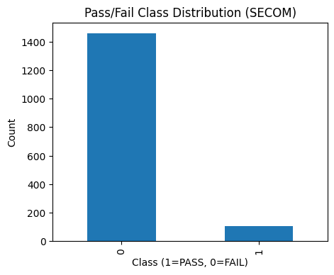

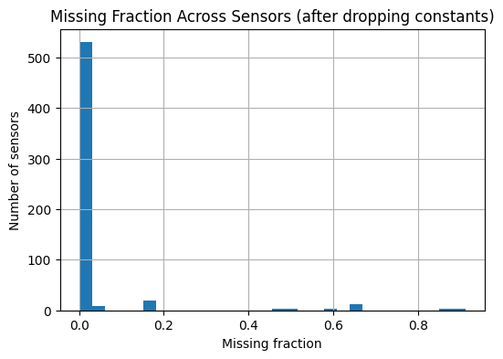

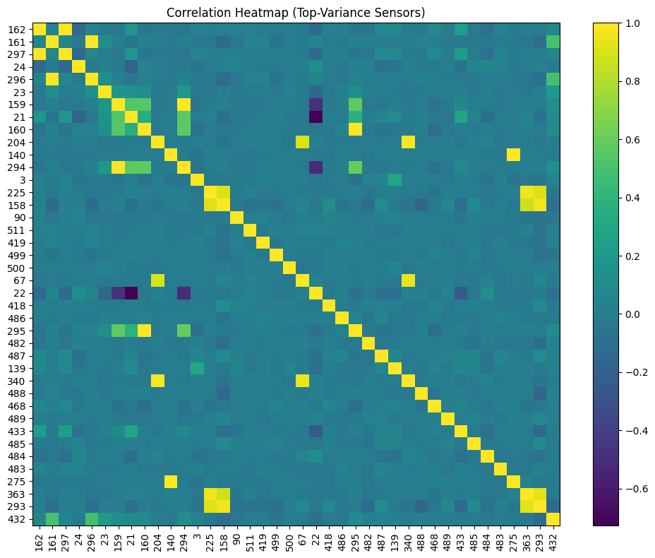
  

EDA highlights:
- Severe class imbalance  
- Mostly complete core sensors with conditional diagnostics  
- Strong subsystem-level correlations  

---

### 6️⃣ Feature Engineering
- Robust scaling  
- Imputation pipelines  
- Preparation for nonlinear models  

---

### 7️⃣ Modeling
- **Logistic Regression** – baseline, interpretable  
- **Random Forest** – nonlinear, subsystem-aware  

---

### 8️⃣ Model Evaluation

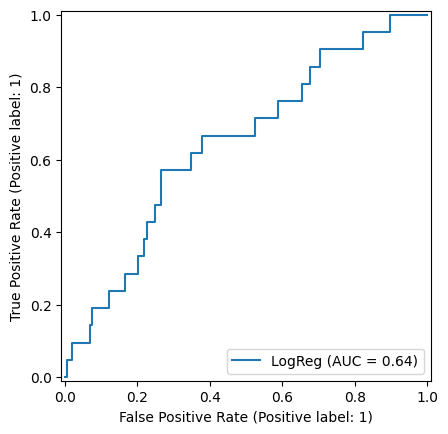

| Model | ROC-AUC |
|-----|--------|
| Logistic Regression | ~0.64 |
| Random Forest | ~0.78 |

**Interpretation**
- Yield risk is **not linearly separable**
- Nonlinear interactions between tool subsystems dominate
- Ensemble models better capture lithography behavior

---

### 9️⃣ Operational Insight: Confusion Matrix

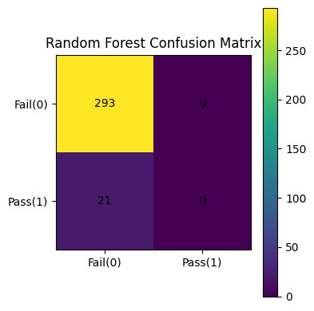
  

At default thresholds, the Random Forest behaves **conservatively**, flagging nearly all runs as FAIL.

> **Prediction ≠ Decision**  
> Threshold tuning is essential to balance **yield protection vs throughput**.

---

## 🔍 Explainability & Root-Cause Insight

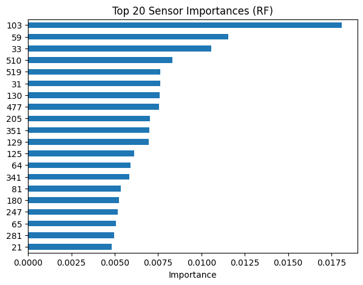

Key observations:
- Only **~10–20 sensors dominate** model decisions  
- Reflect real lithography subsystems:
  - Illumination stability  
  - Focus control  
  - Thermal regulation  
  - Stage dynamics  

---

## 📡 Deployment & Drift Monitoring

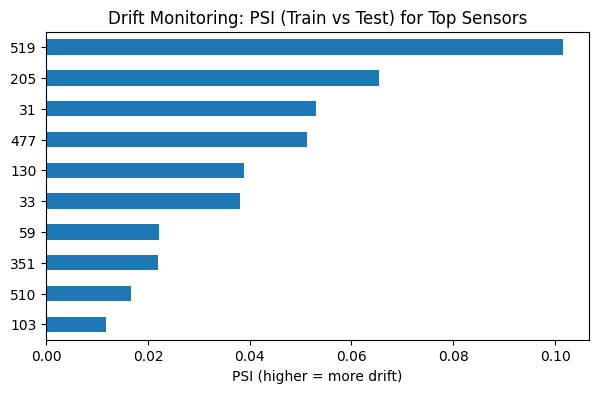

- Drift monitored using **Population Stability Index (PSI)**
- Early-stage drift detected in key sensors
- No catastrophic shifts, but signals of:
  - Tool aging
  - Process change
  - Recipe evolution  

> This mirrors how fabs monitor equipment health in production.

---

## 🚀 Why This Project Stands Out

✔ Real semiconductor manufacturing data  
✔ High-dimensional, imbalanced industrial ML problem  
✔ Strong focus on explainability and deployment readiness  
✔ Direct relevance to **AI chip production and advanced nodes**

---

## 📌 Future Enhancements
- Threshold optimization for fab decision policies  
- Precision-Recall analysis  
- Risk banding (Green / Yellow / Red)  
- SHAP-based local explanations  
- Dashboard integration (Power BI / Plotly Dash)
  
---

# Project 3: Reliability Analysis & Survival Modeling

### Kaplan–Meier, Hazard Functions, and Batch Comparison

---

## 📌 Project Overview

This project focuses on reliability engineering and time-to-event analysis using survival analysis techniques. The objective is to model failure behavior over time, quantify survival probabilities, and compare reliability performance across manufacturing batches.

The analysis applies industry-standard statistical methods widely used in manufacturing, aerospace, defense, and semiconductor reliability studies.

---

## 🎯 Objectives

- Model time-to-failure behavior using Kaplan–Meier survival estimation

- Distinguish failure vs. censored observations

- Compare survival performance between Batch A and Batch B

- Analyze hazard (failure) rates over time

- Support data-driven reliability and quality decisions

---

## 🧠 Methods & Techniques

- Kaplan–Meier Estimator

- Censoring analysis

- Survival curve comparison by group

- Hazard function estimation

- Exploratory distribution analysis

- Confidence interval visualization

---

## 📊 Key Visualizations & Insights

### 1️⃣ Kaplan–Meier Survival Curve

This plot estimates the probability that a unit survives beyond a given time.

Steep early decline indicates early-life failures

Gradual tail suggests wear-out behavior

Confidence bands show estimation uncertainty over time

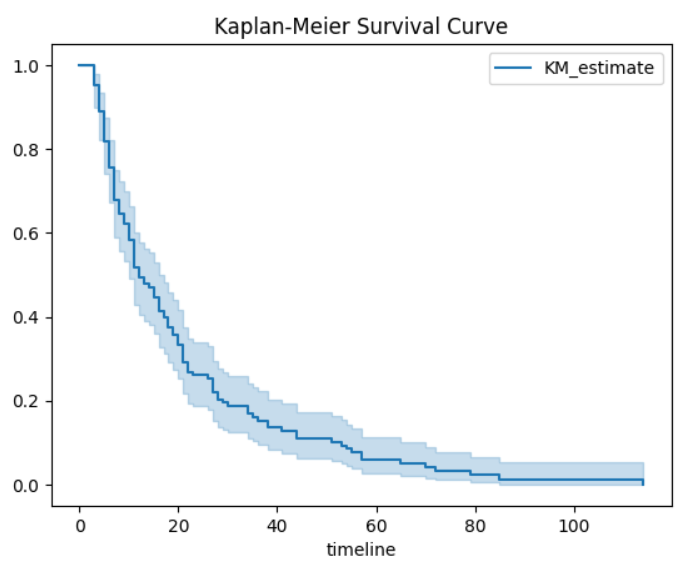

---

### 2️⃣ Time-to-Event Distribution (Failure vs. Censored)

This visualization contrasts observed failures against censored observations.

Failures dominate early time periods

Censored observations increase at later times

Confirms the need for survival modeling vs. simple averages

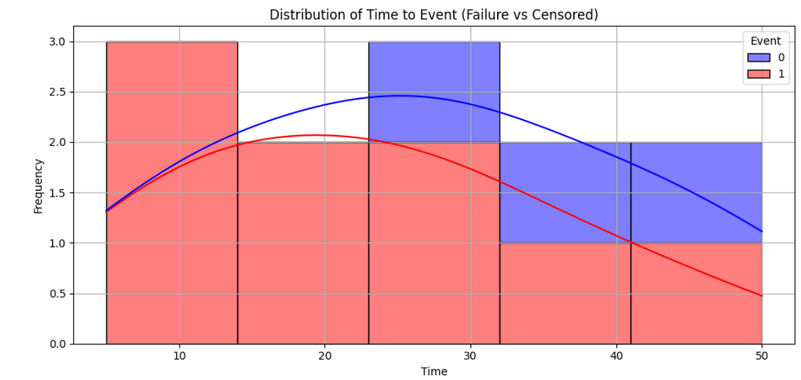

---

### 3️⃣ Survival Probability Comparison (Batch A vs. Batch B)

This comparison highlights reliability differences between manufacturing batches.

Batch A demonstrates consistently higher survival probability

Batch B experiences earlier degradation

Confidence intervals reflect statistical uncertainty

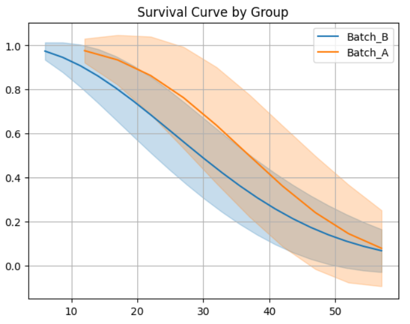

---

### 4️⃣ Smoothed Survival Trends

Smoothed curves help reveal underlying reliability trends.

Batch A shows delayed failure onset

Batch B exhibits faster reliability decay

Useful for management-level interpretation

---

### 5️⃣ Hazard Function Analysis

The hazard function represents the instantaneous failure rate.

Increasing hazard rate indicates aging or wear-out failure mode

Critical for maintenance planning and lifecycle decisions

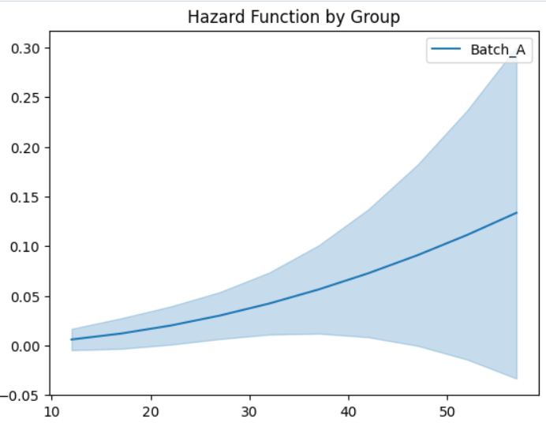

---

## 📈 Business & Engineering Impact

- Enables predictive maintenance strategies

- Supports supplier and batch qualification

- Reduces unexpected failures and downtime

- Improves manufacturing reliability and quality control

- Applicable to aerospace, defense, electronics, and semiconductor systems

---

## 🛠 Tools & Technologies

- Python

- NumPy, Pandas

- Matplotlib / Seaborn

- Lifelines (Survival Analysis)

- Jupyter Notebook
  
---

📁 Notebook:
Reliability Analysis Using Weibull Modeling.ipynb

---

### 🔍 Key Takeaway

Survival analysis provides a statistically robust framework to evaluate reliability, account for censored data, and compare manufacturing performance across batches—far beyond traditional MTBF metrics.

---

# 📊 Project 4: Oath–Outcome Alignment Analysis  
### *From Constitutional Promises to Measurable Outcomes*

---

## 📌 Project Overview

This project applies **data science, statistical modeling, and natural language processing (NLP)** to evaluate whether real-world institutional outcomes align with the **constitutional obligations defined in official government oaths**.

Public institutions in the United States—**military, law enforcement, judiciary, and civil government**—derive their authority from oaths sworn to the U.S. Constitution. While these oaths establish clear legal and ethical obligations, there is limited **quantitative research** measuring how closely institutional behavior aligns with those commitments.

This project addresses that gap by converting **normative legal principles into measurable signals** and comparing them against observed institutional outcomes.

---

## 🎯 Research Question

**Do institutional outcomes align with the constitutional obligations defined in official oaths?**

---

## 🧠 Why This Matters

- Converts normative constitutional law into **quantifiable metrics**
- Bridges **law, ethics, governance, and data science**
- Moves beyond anecdotal accountability toward **evidence-based oversight**
- Rarely studied quantitatively in academic or policy literature

**Relevant to:**
- Oversight bodies  
- Inspectors General  
- Civil rights organizations  
- Policy analysts  
- Academic researchers  

---

## 📊 Key Visualizations

### 🔵 Oath vs Outcome Radar Chart (Law Enforcement Example)

### 🔵 Oath vs Outcome Radar Chart

**Interpretation**
- Large gaps between oath commitments and outcomes indicate **institutional misalignment**
- Collapsed outcome area signals **enforcement or accountability failure**
- Symmetry would indicate constitutional compliance

---

### 📉 Distribution of OOAS Across Agencies

**Insight**
- Left-skewed distributions highlight **systemic negative alignment**
- Outliers identify institutions requiring immediate oversight attention

---

### 🔥 OOAS Heatmap by Agency & State

**Insight**
- Enables **cross-jurisdictional comparison**
- Reveals geographic and institutional accountability disparities

---

## 🔬 Methodology

**Text Analysis (NLP)**
- Oath language extraction
- Constraint density and clarity scoring

**Feature Engineering**
- Accountability strength
- Power–constraint ratios

**Statistical Modeling**
- Regression analysis
- Institutional comparison

**Visualization**
- Radar charts  
- Heatmaps  
- Trend analysis  
---

## 📊 Project 5: Data Center Insights with Data Science & Engineering

### *Operational Intelligence, Reliability, and Performance Optimization*

---

## 📌 Project Overview

This project applies **data science methods grounded in engineering principles** to analyze and interpret **data center operational behavior**, focusing on **thermal stability, energy consumption, and communication efficiency**.

Modern data centers function as tightly coupled cyber-physical systems. Small deviations in temperature, power usage, or communication latency can propagate into **equipment stress, efficiency loss, or reliability risk**. This project demonstrates how **engineering-aware analytics** can support **proactive monitoring and decision-making**.

---

## 🎯 Analytical Objectives

* Monitor and interpret **thermal system behavior**
* Evaluate **power consumption patterns** over operational cycles
* Compare **communication latency** across physical transmission media
* Translate engineering signals into **data-driven operational insights**

---

## 📈 Key Visual Analyses

### 🌡️ Reactor / Equipment Temperature Monitoring (24-Hour Cycle)

**Insight**

* Shows diurnal temperature variation and peak thermal loading
* Dashed threshold highlights **risk zones** requiring alerts or control actions
* Demonstrates how time-series monitoring supports **preventive intervention**
* Directly applicable to **thermal management of racks, cooling loops, and DAHUs**

---

### ⚡ Power Consumption Patterns in a Data Center

**Insight**

* Captures cyclical load behavior across a 24-hour operational window
* Peak demand periods correlate with increased cooling and compute activity
* Supports:

  * Energy efficiency optimization
  * Capacity planning
  * PUE-oriented performance analysis

---

### 🚀 Communication Latency: Optical vs Electrical Transmission

**Insight**

* Quantifies latency growth as a function of distance
* Demonstrates superior scalability of **optical fiber** for low-latency environments
* Reinforces engineering trade-offs in **network design for data centers**
* Relevant to:

  * High-performance computing
  * Low-latency cloud services
  * Backbone infrastructure planning

---

## 🧠 Engineering + Data Science Integration

This project explicitly connects:

* **Physical system behavior** (temperature, power, signal propagation)
* **Data science tools** (EDA, visualization, trend analysis)
* **Engineering constraints** (thresholds, efficiency limits, reliability curves)

Rather than treating data as abstract, each variable is interpreted within its **physical and operational context**.

---

## 🧪 Deliverables

* 📓 Jupyter Notebook with reproducible analysis
* 📊 Engineering-driven visual analytics
* 🧠 Operational insights for infrastructure optimization
* 📘 Documentation linking analytics to real data center systems

---

## 🚀 Future Extensions

* Predictive maintenance models (thermal & electrical)
* Time-series forecasting of energy demand
* Anomaly detection for early fault identification
* Integration with real sensor telemetry (IoT / BMS / EPMS)

---

## 📁 Project Files

📓 The Data Center insights with Data science and engineering (1).ipynb

---

## 📡 Project 6: Wi-Fi Optimization & Communication Performance Analysis

### *Signal Quality, Reliability, and Network Efficiency*

---

## 📌 Project Overview

This project applies **data science, signal processing concepts, and network engineering principles** to analyze **wireless communication performance**, with a focus on **signal reliability, coverage quality, and user-level optimization**.

Wireless networks are fundamental to modern digital infrastructure, yet their performance is constrained by **noise, interference, distance, and infrastructure placement**. This project demonstrates how **engineering-informed analytics** can be used to evaluate and optimize Wi-Fi performance using **quantitative signal metrics**.

---

## 🎯 Analytical Objectives

* Quantify the relationship between **Signal-to-Noise Ratio (SNR)** and **Bit Error Rate (BER)**
* Analyze **spatial Wi-Fi coverage quality** across a service area
* Evaluate **user-level throughput optimization** under SNR constraints
* Support data-driven decisions for **access-point placement and network tuning**

---

## 📈 Key Visual Analyses

### 📉 Bit Error Rate vs Signal-to-Noise Ratio (QPSK)

**Insight**

* Demonstrates the exponential reduction in **bit errors** as SNR increases
* Highlights the reliability threshold required for stable digital communication
* Reinforces theoretical expectations from **digital modulation and communication theory**
* Relevant to network design, error control, and quality-of-service planning

---

### 🗺️ Wi-Fi Coverage Map: Average SNR by Region

**Insight**

* Visualizes spatial variation in **signal quality**
* Identifies low-SNR regions requiring infrastructure improvement
* Supports **access-point optimization** and coverage gap detection
* Applicable to enterprise networks, campuses, and data center environments

---

### 🚀 User Optimization: SNR vs Throughput

**Insight**

* Shows throughput sensitivity to SNR degradation
* Threshold lines highlight **performance drop-off zones**
* Enables classification of **low-quality user experiences**
* Supports intelligent AP assignment and load balancing strategies

---

## 🧠 Engineering & Data Science Integration

This project integrates:

* **Communication theory** (SNR, BER, modulation efficiency)
* **Statistical visualization and analysis**
* **Network performance engineering**
* **Optimization logic** grounded in real-world constraints

Each result is interpreted in the context of **physical signal behavior and network performance limits**.

---

## 🧪 Deliverables

* 📓 Jupyter Notebook with reproducible simulations
* 📊 Communication performance visualizations
* 📡 Network optimization insights
* 📘 Engineering-aware documentation

---

## 🚀 Future Enhancements

* Adaptive modulation and coding analysis
* Machine-learning-based AP selection
* Time-varying interference modeling
* Integration with real Wi-Fi telemetry data

---

## 📁 Project Files

📓 Wifi optimization (1).ipynb

---

## 👤 Author

**Jemael Nzihou**
PhD Student — Data Science 
Chemical Engineer | Business Analytics | Quality Champion certified  
🔗 Portfolio: https://jemaelnzihou.github.io/Jemael-Nzihou-Portfolio/  
🔗 LinkedIn: https://www.linkedin.com/in/jemaelnzihou
---

## 📜 License

This project is released for **research and educational use**.
Please cite appropriately if used in academic or policy work.

