# 📊 Data Science Projects

# 🧠 AI-Driven Energy Value Chain Optimization

**Petroleum & Chemical Engineering + Data Science + Machine Learning**

---

## 🚀 Project Overview

This project demonstrates how **petroleum engineering and chemical engineering systems can be optimized using machine learning** across the entire energy value chain:

* 🛢️ **Upstream** – Production Forecasting
* 🚚 **Midstream** – Pipeline Blockage Risk Detection
* 🏭 **Downstream** – Refinery Yield Optimization

The goal is to simulate a **real-world industrial intelligence system** that enables **data-driven decision-making in energy operations**.

---

## 🎯 Objectives

* Predict oil production based on reservoir and operational conditions
* Detect pipeline blockage (hydrate) risks before failure occurs
* Optimize refinery yield based on crude quality and process variables
* Build a dashboard for **real-time insights and decision support**

---

## ⚙️ System Architecture

```
Engineering System → Data → Machine Learning → Dashboard → Decisions
```

---

## 🛢️ A. Upstream Model — Production Forecasting

### 🎯 Goal  
Predict oil production rates using reservoir and operational parameters

### 📊 Inputs  
- Reservoir pressure  
- Choke size  
- Gas-oil ratio  
- Water cut  
- CO₂ injection (EOR)  

### 🤖 Model  
Random Forest Regressor  

---

## 📈 Model Performance

| Metric | Value |
|--------|------|
| MAE    | 42.84 |
| RMSE   | 55.28 |
| R²     | 0.8355 |

👉 The model explains **~83.5% of production variability**, showing strong predictive capability.

---

## 🔍 Feature Importance

| Feature               | Importance |
|----------------------|-----------|
| Reservoir Pressure   | 0.3799 |
| Water Cut            | 0.3281 |
| Choke Size           | 0.2292 |
| CO₂ Injection Rate   | 0.0370 |
| Gas-Oil Ratio        | 0.0259 |

💡 **Key Insight:**
- Reservoir pressure and water cut are the **dominant drivers of production**
- Water cut negatively impacts efficiency
- CO₂ injection provides **secondary enhancement (EOR effect)**

---

## 📊 Model Visualization

 

👉 The model shows strong alignment between actual and predicted values, indicating reliable forecasting performance.

---

## 💡 Business Impact

- Optimize well performance using pressure & choke adjustments  
- Identify production decline early  
- Improve Enhanced Oil Recovery (EOR) strategies  
- Enable data-driven reservoir management  

---

## 🧮 Engineering Concept

Production flow is governed by:

$q = \frac{kA}{\mu} \frac{dP}{dx}$

This model approximates how operational and reservoir conditions influence production behavior using machine learning.

---

## 🚚 B. Midstream Model — Pipeline Blockage Risk

### 🎯 Goal

Predict hydrate/blockage risk in pipelines

### 📊 Inputs

* Pressure
* Temperature
* Flow rate
* Water cut
* Inhibitor dosage

### 🤖 Model

Random Forest Classifier

### 💡 Impact

* Prevent pipeline shutdowns
* Reduce maintenance costs
* Improve system reliability

---

## 🏭 C. Downstream Model — Refinery Yield Optimization

### 🎯 Goal

Predict refinery output efficiency

### 📊 Inputs

* API gravity
* Sulfur content
* Furnace temperature
* Catalyst activity

### 🤖 Model

Random Forest Regressor

### 💡 Impact

* Increase product yield
* Reduce waste
* Improve profit margins

---

## 📊 Dashboard Features

Built with **Streamlit**, the dashboard provides:

* 📈 Real-time KPIs (production, risk, yield)
* 🚨 Pipeline risk alerts (HIGH / LOW)
* ⚙️ Refinery optimization simulator
* 📉 Model performance visualizations

---

## 🧮 Engineering & Mathematical Concepts

### 🔹 Production Flow (Reservoir Engineering)
$q = \frac{kA}{\mu} \frac{dP}{dx}$

### 🔹 Heat Transfer (Refining)
$Q = \dot{m} C_p \Delta T$

### 🔹 Thermodynamics (Gas Behavior)
$PV = nRT$

### 🔹 System Representation
$\text{Output} = f(\text{Operating Conditions})$

---

## 🛠️ Tech Stack

* Python
* Pandas, NumPy
* Scikit-learn
* Matplotlib
* Streamlit

---

## 📂 Project Structure

```
energy-value-chain-optimization-ai/
│
├── data/                  # Synthetic dataset
├── notebooks/             # Colab/analysis notebooks
├── src/                   # ML pipeline code
├── dashboard/             # Streamlit dashboard
├── images/                # Visual outputs
├── README.md
└── requirements.txt
```

---

## ▶️ How to Run

```bash
# Install dependencies
pip install -r requirements.txt

# Generate dataset
python src/data_generation.py

# Train models
python src/train_models.py

# Run dashboard
streamlit run dashboard/app.py
```

---

## 📈 Business Impact

| Area       | Impact                            |
| ---------- | --------------------------------- |
| Upstream   | Better production planning        |
| Midstream  | Reduced downtime (cost savings)   |
| Downstream | Increased yield & profitability   |
| Overall    | Data-driven engineering decisions |

---

## 💼 Career Relevance

This project is designed to align with roles such as:

* Process Engineer
* Production Engineer
* Flow Assurance Engineer
* Energy Data Scientist
* Process Optimization Engineer
* Industrial / Operations Engineer

---

## 🧲 Why This Project Stands Out

Unlike typical ML projects, this work demonstrates:

✔ Engineering domain expertise

✔ End-to-end system thinking

✔ Real-world industrial applications

✔ Business impact awareness

✔ Integration of AI with physical systems

---

## 🔗 Portfolio Positioning

This project represents the intersection of:

👉 **Chemical Engineering + Petroleum Engineering + Data Science + AI**
    **Focused on AI-driven optimization in energy and industrial systems**

---

## **🔥 Future Improvements**

* Deploy on AWS (S3 + Lambda + API Gateway)
* Integrate real oil & gas datasets
* Add time-series models (LSTM, Prophet)
* Implement anomaly detection for predictive maintenance

---

# 🔐 AI-Powered Cyber Risk Scoring Engine

## 📌 Overview
This project develops a machine learning-based cyber risk scoring engine that classifies enterprise assets into **Low, Medium, High, and Critical** risk categories.

It integrates cybersecurity, governance, and data science to move beyond traditional spreadsheet-based risk assessments toward **predictive, data-driven decision-making**.

---

## 🎯 Business Problem
Organizations often rely on manual and subjective methods to assess cyber risk, which are:
- inconsistent
- time-consuming
- difficult to scale

This project demonstrates how machine learning can improve:
- risk prioritization
- remediation strategies
- governance and compliance processes

---

## 🧠 Objectives
- Build a predictive cyber risk classification model
- Identify key drivers of cyber risk
- Support GRC decision-making using data science
- Demonstrate real-world cybersecurity analytics capability

---

## 📊 Features Used

- CVSS Score (vulnerability severity)
- Patch Delay (days)
- Incident Frequency
- System Criticality
- Third-Party Risk Score
- Compliance Score
- Failed Login Rate
- Data Sensitivity
- Open Security Findings

---

## ⚙️ Model

A **Random Forest Classifier** was used for multiclass classification.

- Handles complex feature interactions
- Robust against overfitting
- Suitable for tabular cybersecurity data

---

## 📈 Model Performance

- **Accuracy:** 86%
- **ROC-AUC:** 0.94 (excellent classification capability)

### Key Observations:
- Strong performance for **Critical risk detection**
- Reduced performance for **Low/Medium classes** due to class imbalance

---

## 🔍 Key Findings

The most influential drivers of cyber risk include:

- CVSS score
- Patch delay
- Open findings
- Failed login rate
- Compliance score
- Third-party risk score

These findings confirm that:
> **Delayed remediation, weak control posture, and unresolved vulnerabilities significantly increase cyber risk exposure.**

---

## ⚙️ Practical Impact (GRC)

This model enables:

- Risk-based prioritization of assets
- Faster remediation decision-making
- Improved audit targeting
- Better third-party risk evaluation

---

## 💼 Executive Value

This solution supports:

- Data-driven cyber risk governance
- Board-level reporting dashboards
- Regulatory compliance (NIST, ISO 27001)
- Operational risk visibility

It demonstrates how AI can transform cybersecurity from reactive to **proactive and predictive**.

---

## ⚠️ Limitations

- Dataset imbalance affects minority class prediction
- Synthetic dataset (simulated environment)

### Future Improvements:
- Apply SMOTE for class balancing
- Integrate real-world CVE/NVD data
- Add SIEM log analytics
- Deploy as a Streamlit web application
- Build Power BI dashboard for executives

---

## 🛠️ Tech Stack

- Python
- pandas, numpy
- scikit-learn
- matplotlib
- Jupyter Notebook

---

## 🚀 Future Enhancements

- Real-time risk scoring pipeline
- Cloud deployment (AWS)
- Integration with security monitoring systems
- AI Governance and Risk modeling extension

---

## 🔗 Keywords

Cybersecurity, GRC, Risk Management, Machine Learning, Data Science, AI, Governance, Compliance, Cyber Risk, Predictive Analytics

---

# 📉 Telco Customer Churn — End-to-End Decision Intelligence System

> **Designing a production-grade churn system that converts ML signals into revenue-preserving decisions**

This project demonstrates how modern data science is applied **inside real companies**:
from ambiguous business problems to **clear, defensible actions**.

Unlike tutorial projects, this system emphasizes:

* business framing
* behavioral segmentation
* explainable modeling
* ROI-aware decision logic

---

## 🎯 Problem Statement

Subscription businesses lose millions annually to churn.
The challenge is **not predicting churn**, but deciding:

* **Which customers are worth saving**
* **Which churn is unavoidable**
* **How to intervene without destroying margin**

This project operationalizes churn management using a decision framework aligned with how teams at **Google, Meta, Amazon, Netflix, and Microsoft** work.

---

## 🧠 System Architecture (High Level)

```
Raw Customer Data
        ↓
Business EDA (Phase 1)
        ↓
Behavioral Segmentation (Phase 2)
        ↓
Churn Modeling (Phase 3)
        ↓
Decision Layer (Phase 4)
        ↓
Retention Actions (CRM / Ops Ready)
```

Core decision logic:

```
Segment × Churn Risk × Customer Value
```

---

## 🔍 Phase 1 — Business EDA

**Understand churn as an economic problem**

### Key Visuals

📊 **Overall Churn Rate**

 

*~27% churn → material revenue risk requiring targeted intervention*

📊 **Churn by Contract Type**

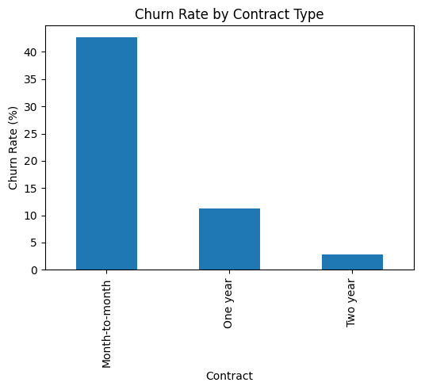 

*Month-to-month customers churn 3–4× more than long-term contracts*

📊 **Churn by Tenure Band**

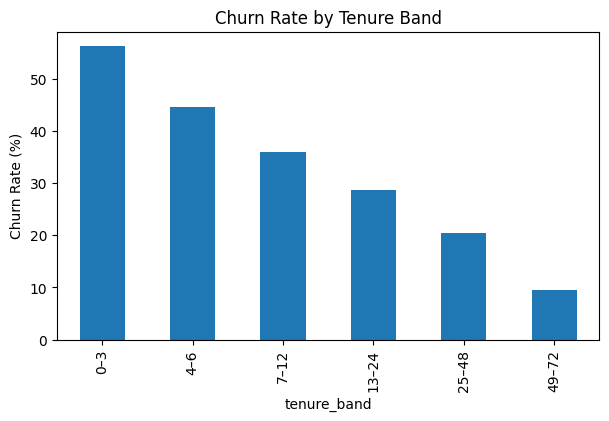

*Highest churn occurs in the first 6–12 months*

📊 **Churn by Internet Service**

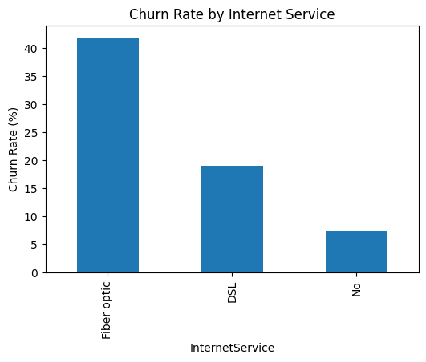 

*Fiber optic users show elevated churn → expectation gap*

---

## 👥 Phase 2 — Behavioral Segmentation

**Move from “all customers” to decision-ready personas**

📊 **Elbow Method for K-Means**

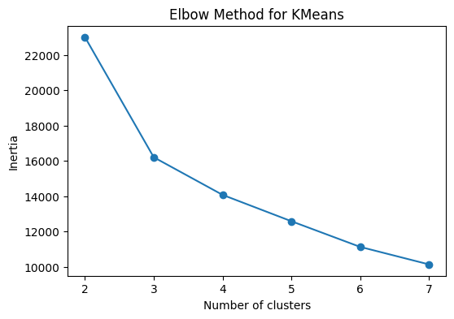 

*Four stable, interpretable segments selected*

👥 **Customer Segmentation — K-Means (PCA Projection)**

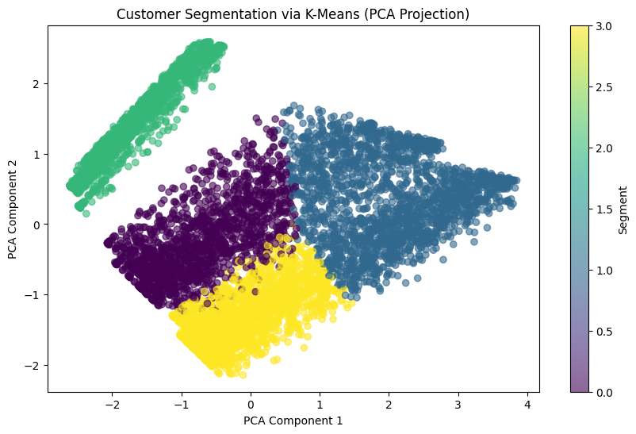

**Customers cluster into four distinct behavioral personas based on tenure, spend, and service usage.**

🎯 **Segment Centers — K-Means with Centroids**

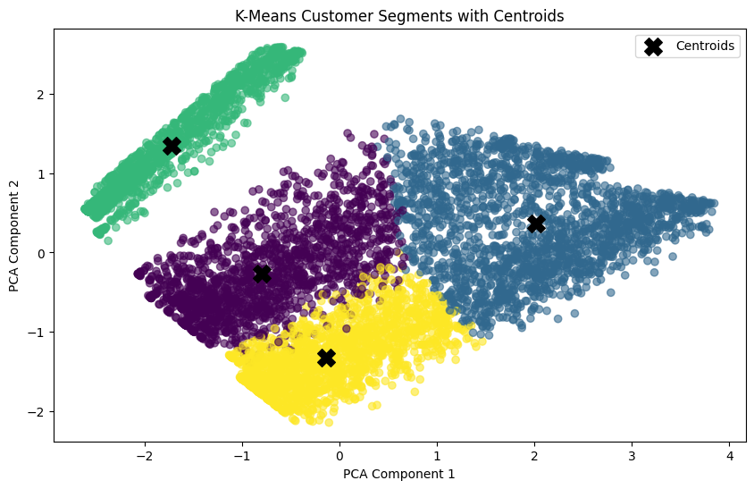

**Centroids represent the behavioral “center” of each segment, enabling stable personas and consistent downstream decision-making.**

📊 **Segment Profiles**

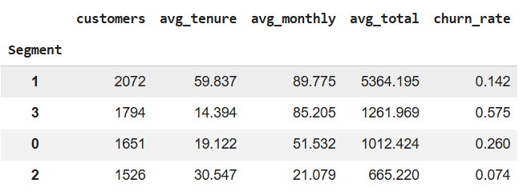


| Segment                 | Churn | Value     | Business Meaning   |
| ----------------------- | ----- | --------- | ------------------ |
| High value + Low churn  | Low   | Very high | Core revenue base  |
| High value + High churn | High  | Moderate  | Revenue at risk    |
| Low value + High churn  | High  | Low       | Poor ROI           |
| Low value + Low churn   | Low   | Low       | Stable, low margin |

---

## 🤖 Phase 3 — Churn Modeling

**Predict churn with explainability**

📊 **Global Model Performance**

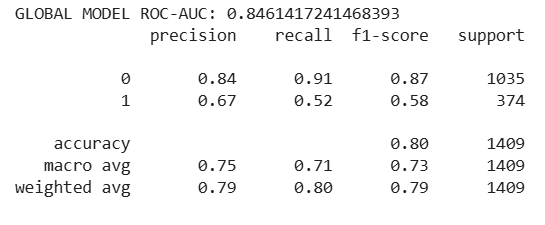

* ROC-AUC ≈ **0.85**
* Accuracy ≈ **80%**
* Conservative by design → minimizes wasted retention spend

📊 **Top Churn Drivers**

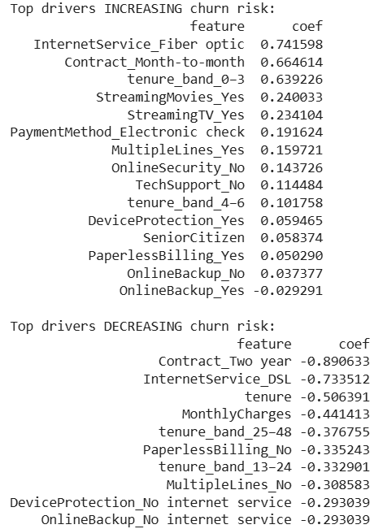

**Increases churn**

* Fiber optic service
* Month-to-month contracts
* Early tenure
* Lack of tech support

**Reduces churn**

* Two-year contracts
* Longer tenure
* Lower monthly charges

📌 The model explains **what to fix**, not just *who might leave*.

---

## 🎯 Phase 4 — Decision Layer

**From prediction → action**

📊 **Segment Strategy Matrix**


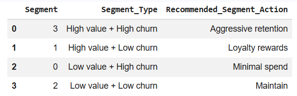


| Segment Type            | Action               |
| ----------------------- | -------------------- |
| High value + High churn | Aggressive retention |
| High value + Low churn  | Loyalty rewards      |
| Low value + High churn  | Minimal spend        |
| Low value + Low churn   | Maintain             |

📊 **Customer-Level Retention Priority**

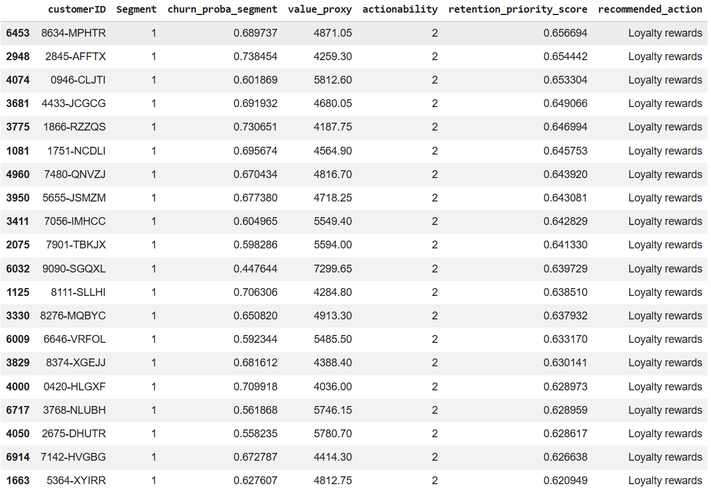

Each customer receives:

* churn probability (segment-aware)
* value proxy
* actionability score
* ranked retention priority
* recommended action

This output is **CRM-ready**.

---

## 🧠 Impact

> This system enables leadership to **reduce churn while protecting margin**, by acting only where ROI is positive.

What this project demonstrates:

* Strategic thinking (not just ML)
* Decision intelligence
* Explainable AI
* Production-ready analytics
---

### 🧠 Why This Matters

Most churn projects stop at **“who might churn.”**
This project answers **“who should we act on, and why.”**

That distinction is what separates **academic ML** from **production data science**.

## 🏁 Final Note 

> This project mirrors how churn analytics is built and deployed in real organizations — combining modeling, segmentation, and business decision-making into one system.

---


# 🧠 Project 1 — Physics-Informed Neural Networks (PINNs)

## *Heat Transfer Modeling in Chemical Reactors*

---

## 🔍 Overview

This project implements a **Physics-Informed Neural Network (PINN)** to model **transient heat diffusion** in a chemical reactor using **first-principles physics embedded into a neural network**.

Rather than relying purely on data, the model enforces the **1D heat equation** during training, enabling **physically consistent predictions even with sparse or noisy measurements**—a key requirement for engineering systems and digital twins.

---

## 🎯 Objectives

* Model **transient heat diffusion** using a neural network
  
* Enforce physical consistency via **PDE residual minimization**
  
* Validate predictions against a **closed-form analytical solution**
  
* Produce engineering-ready outputs (profiles, error maps, metrics)

---

## 📐 Governing Physics (Engineering Form)

**Heat diffusion (1D, transient):**

```
∂T/∂t = α · ∂²T/∂x²
```

Where:

* `T(x,t)` = temperature
* `α = k / (ρ · cₚ)` = thermal diffusivity

**Boundary conditions:**

```
T(0,t) = 0
T(1,t) = 0
```

**Initial condition:**

```
T(x,0) = sin(πx)
```

**Analytical validation solution:**

```
T(x,t) = exp(-α·π²·t) · sin(πx)
```

---

## 🧠 Methods & Model Design

* **Model:** Multi-Layer Perceptron (MLP) mapping `(x, t) → T(x,t)`
* **Training strategy:** physics collocation sampling across space–time
* **Physics enforcement:** automatic differentiation
* **Loss components:**

  * PDE residual loss (physics enforcement)
  * Boundary condition loss
  * Initial condition loss
  * *(Optional)* sparse sensor data loss

## **📊 Visual Results**

**🔁 Training Loss Convergence (Total, PDE, BC, IC)**

Shows stable convergence of the physics-constrained loss components.

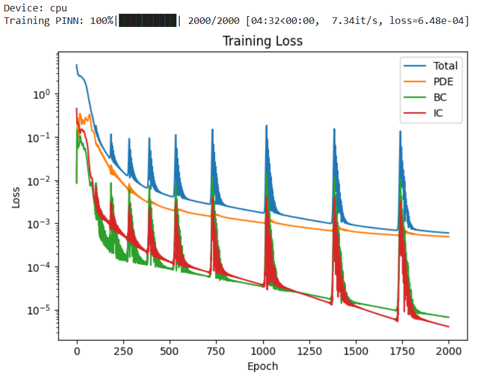 


- All loss components (PDE, Boundary, Initial) decrease by several orders of magnitude

- The total loss converges to **~10⁻⁴**

- Periodic spikes appear in the loss curves

### **🧠 Interpretation**

- The PDE loss decreasing confirms the network is learning a function that satisfies the heat equation

- The BC and IC losses dropping faster indicates that boundary and initial constraints are easier to satisfy than interior physics

### **The periodic spikes are normal in PINNs and occur because:**

- The optimizer alternates between satisfying different competing constraints

- Physics, BCs, and ICs pull the solution in slightly different directions

- Overall downward trend → stable, convergent training


### **🔬 Physical meaning**

The network is not just fitting data — it is learning a temperature field that obeys energy conservation throughout the domain.

**✔️ This confirms successful physics enforcement, not just numerical curve fitting.**


### **🌡️ Temperature Profiles — PINN vs Analytical**

Comparison across multiple time slices validates physical accuracy.

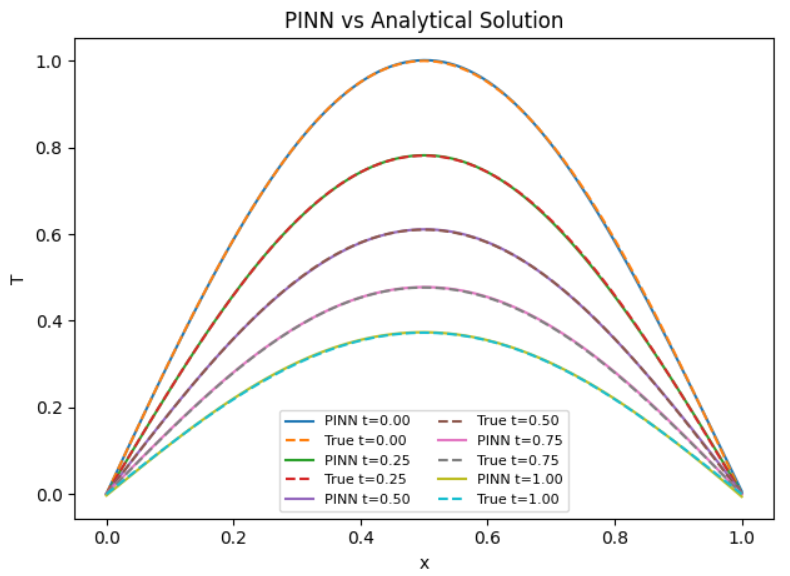


- PINN predictions (solid lines) overlap almost perfectly with analytical solutions (dashed)

Agreement holds across all time slices:

- **𝑡=0.00**
  
- **t=0.25**
  
- **t=0.50**

- **t=0.75**

- **t=1.00**

### **🧠 Interpretation**

**The PINN accurately captures:**

- Spatial shape (sinusoidal mode)

- Temporal decay (exponential damping)

- No phase shift, no amplitude drift — even at later times

### **🔬 Physical meaning**

**The model has learned:**

- The **dominant eigenmode** of the heat equation

- The **correct decay rate** governed by thermal diffusivity 𝛼

This shows the PINN has internalized the governing physics, not memorized discrete points.

**✔️ This level of overlap is equivalent to a high-resolution numerical solver.**


### **🔥 Absolute Error Heatmap (Space–Time)**

**Highlights regions of higher error and overall solution fidelity.**

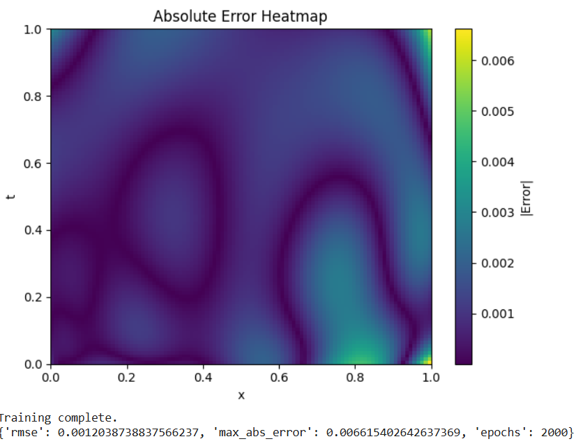 


- Errors are uniformly low across most of the domain

- **Slightly higher errors near:**

- Early time **𝑡≈0**

- Boundaries **x≈0 and x≈1**

- Maximum error ≈ **6.6 × 10⁻³**

### **🧠 Interpretation**

**Higher error near t=0 is common because:**

- The solution transitions sharply from the initial condition

**Boundary regions are more sensitive due to:**

- Competing enforcement of BCs and PDE constraints

### **Importantly:**

- No error blow-up

- No instability over time

### **🔬 Physical meaning**

**The PINN provides a globally consistent thermal field, suitable for:**

- Design analysis

- Optimization

- Digital twin deployment

The smooth error structure indicates **numerical stability**, not overfitting.

## **📊 Quantitative Summary (From Metrics)**

- RMSE ≈ 1.2 × 10⁻³

- Max absolute error ≈ 6.6 × 10⁻³

### **Interpretation**

- Errors are <1% of peak temperature

- Comparable to (or better than) coarse CFD / FDM grids

- Achieved without mesh generation

**✔️ This validates PINNs as a credible alternative to traditional solvers.**

## **🧠 Big-Picture Insight**

**This experiment shows that the PINN:**

- Learns physical laws, not just data

- Generalizes across the entire space–time domain

- Produces smooth, physically meaningful solutions

- Remains stable over long time horizons

**In other words:**

- We have built a working scientific machine learning solver.

### **📌 Final Insight**

**A Physics-Informed Neural Network was trained to solve the 1D transient heat equation, achieving sub-percent error and near-perfect agreement with analytical solutions across the full space–time domain.**
  
---

## **📈 Key Outputs**

The project generates:

* Loss convergence curves
* PINN vs analytical temperature profiles
* Absolute error heatmaps
* Quantitative metrics (RMSE, max error)

---

## **💼 Applications**

* **Chemical Engineering:** hot-spot detection, reactor thermal safety
* **Industrial AI:** physics-guided surrogate modeling
* **Data Centers:** thermal digital twins, cooling optimization (CRAC/CRAH, liquid loops)
* **Energy & Aerospace:** fast thermal solvers for what-if analysis

---

## 🛠 Tools & Technologies

* Python
* PyTorch (automatic differentiation)
* NumPy
* Matplotlib

---

## 📁 Project Files

* Physics-Informed Neural Networks (PINNs).ipynb
* `train.py` — training, evaluation, and plotting
* `pinn.py` — PINN architecture and PDE residual
* `utils.py` — analytical solution and helpers

---

## **🚀 Future Extensions**

* 2D / 3D geometries
* Convection and reaction heat generation
* Inverse problems (estimate `α` or boundary heat flux)
* Reinforcement-learning-based control
* Streamlit or cloud-based dashboards

---

# 📊 Project 2 — Dynamic Temperature & Velocity Analysis in Engineering Systems

## 🔍 Overview
This project applies **data science, exploratory data analysis (EDA), and predictive modeling** to analyze **thermal and fluid dynamic behavior** in two critical engineering systems:

- **Heat Exchangers**
- **Chemical Reactors**

By combining **physics-based simulation**, **statistical summaries**, and **predictive trend analysis**, the project demonstrates how data science can be used to **monitor system stability**, **detect deviations**, and **support operational decision-making** in industrial environments.

---

## 🎯 Objectives
- Model **temperature distribution** across time and space  
- Analyze **dynamic temperature control** in a reactor  
- Perform **EDA across multiple physical systems**  
- Compare **observed vs predicted velocity profiles**  
- Evaluate **prediction accuracy for reactor temperature**

---

## 🧪 System 1 — Heat Exchanger Temperature Distribution
This visualization shows how temperature evolves over **time** and **distance** inside a heat exchanger.

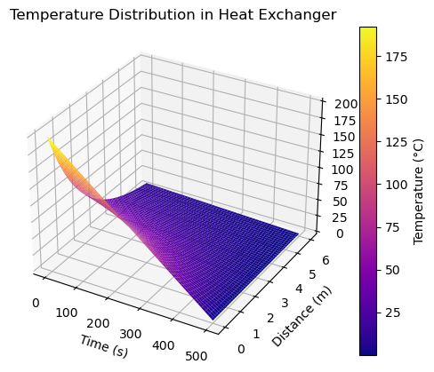

### Key Insights
- Temperature decays with both **time** and **axial distance**
- Highlights **thermal efficiency loss**
- Useful for detecting **ineffective heat transfer zones**

---

## 🔥 System 2 — Dynamic Temperature Control in a Chemical Reactor
A spatio-temporal view of temperature regulation inside a reactor.

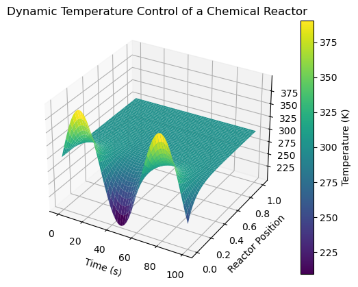

### Key Insights
- Oscillatory behavior indicates **active control dynamics**
- Spatial damping shows **heat dissipation stability**
- Applicable to **process control and safety monitoring**

---

## 📈 Exploratory Data Analysis (EDA) Across Systems
Summary statistics across three subsystems:
- Reactor Temperature
- Pipe Velocity
- Heat Exchanger Temperature
  
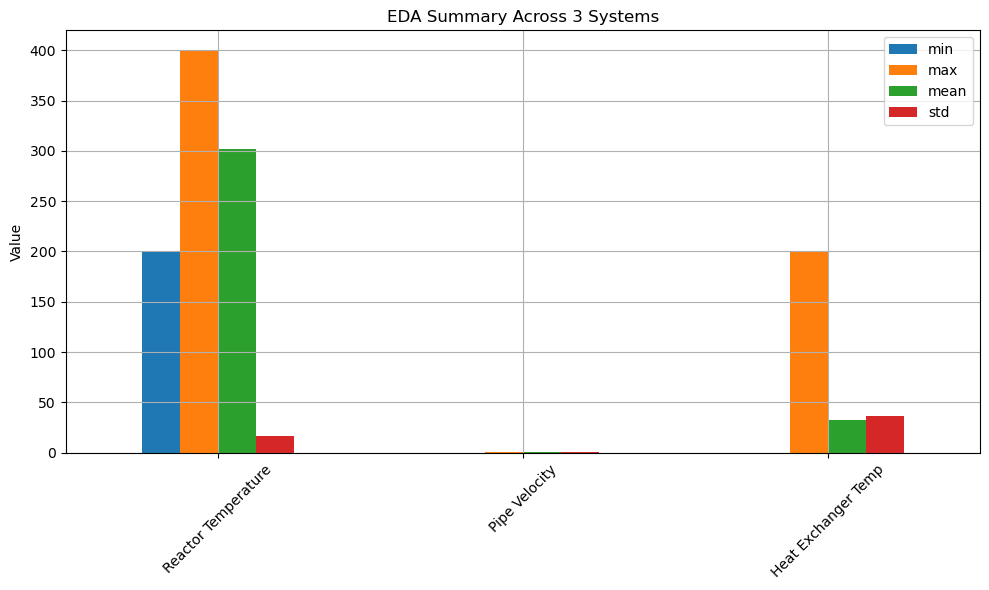

### Metrics Analyzed
- Minimum
- Maximum
- Mean
- Standard Deviation

### Why It Matters
- Identifies **variability and risk**
- Supports **threshold setting**
- Enables **cross-system comparison**

---

## 🚰 Pipe Flow Analysis — Velocity vs Radius
Observed vs predicted velocity distribution along pipe radius.

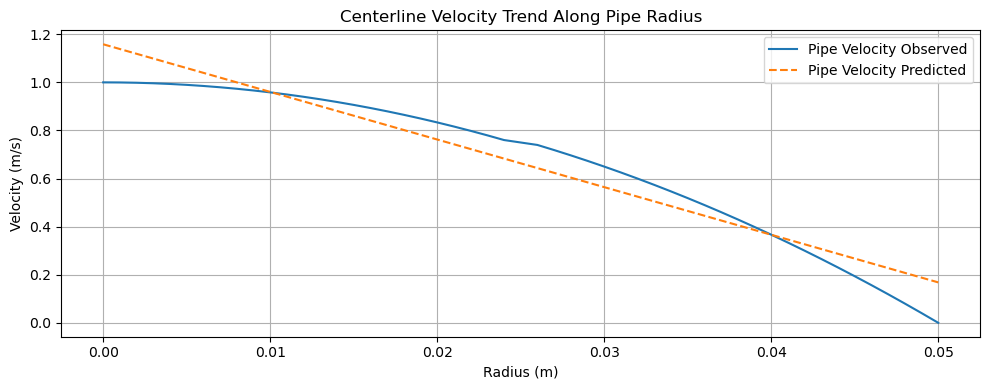

### Key Insights
- Near-parabolic profile consistent with **laminar flow**
- Prediction deviation near pipe wall highlights **model limitations**
- Useful for **hydraulic efficiency validation**
---

## 🤖 Predictive Modeling — Reactor Mid-Position Temperature
Comparison between observed and predicted reactor temperature over time.

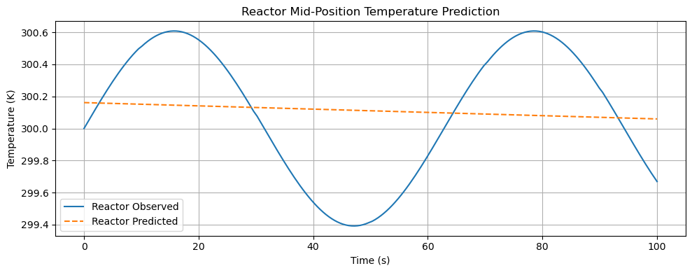

### Key Insights
- Model captures **trend but smooths oscillations**
- Demonstrates bias–variance tradeoff
- Foundation for **advanced ML control models**

---

## 🧠 Data Science Techniques Used
- Exploratory Data Analysis (EDA)
- Time-series trend analysis
- Physics-informed simulation
- Model vs observation comparison
- Visualization with Matplotlib & NumPy

---

## 🛠 Tools & Technologies
- Python
- NumPy
- Matplotlib
- Jupyter Notebook
- Statistical Analysis
- Engineering Modeling

📂 Notebook:

Heat Exchangers vs. Reactors – The Role of Dynamic Temperature & Fluid Velocity Profiles.ipynb

---

## 🚀 Applications
- Process Engineering
- Chemical & Thermal Systems
- Manufacturing Optimization
- Predictive Maintenance
- Data-Driven Engineering Decisions

---

## ⭐ Why This Project Matters
This project demonstrates how **data science bridges theory and real-world engineering systems**, enabling:
- Better control
- Higher efficiency
- Safer operations
- Smarter decision-making
  
---

# 📊 Project 3: Photolithography Yield Risk Prediction  
## AI-Driven Pass/Fail Modeling for Semiconductor Manufacturing

  **Project Type:** Industrial Data Science · Manufacturing AI · Explainable ML  
  **Dataset:** SECOM Semiconductor Manufacturing Dataset (UCI ML Repository)

---

## 🧰 Tools & Technologies

- **Programming:** Python  
- **Libraries:** Scikit-Learn, Pandas, NumPy, Matplotlib  
- **Methods:** Classification, Ensemble Learning, Explainable AI, Drift Monitoring  

---

## 🔬 Project Overview

Modern semiconductor manufacturing—especially **photolithography**—operates under extremely tight process windows. Small deviations in **exposure, focus, thermal stability, or tool health** can lead to **critical dimension (CD)** or **overlay excursions**, resulting in yield loss.

This project develops an **AI-driven pass/fail risk prediction system** using real semiconductor process sensor data.  
The objective is to **identify yield risk before downstream metrology**, enabling:

- Earlier intervention  
- Higher throughput  
- Improved fab stability  

---

## 🎯 Business & Engineering Objective

### Problem Statement
**Can we predict whether a manufacturing run will PASS or FAIL specification using high-dimensional process sensor data—before final inspection?**

### Why This Matters
- AI chips require **near-perfect yield**
- Lithography tools are **capital-intensive bottlenecks**
- Early risk detection reduces:
  - Scrap
  - Rework
  - Tool downtime
  - Throughput loss

---

## 🧠 Dataset Description

**Source:** UCI Machine Learning Repository – SECOM Dataset  

| Attribute | Value |
|---------|------|
| Samples | 1,567 manufacturing runs |
| Sensors | 590 process variables |
| Target  | Pass / Fail |

### Key Characteristics
- High dimensionality (**p ≫ n**)  
- Severe class imbalance (~93% FAIL, ~7% PASS)  
- Structured missing data (conditional sensors)  
- Strong subsystem correlations  

> ✅ This makes the dataset **highly realistic** for semiconductor manufacturing analytics.

---

## 🔄 Data Science Lifecycle (Photolithography Context)

### 1️⃣ Problem Definition
- Predict yield risk (PASS/FAIL) prior to metrology  
- Analogous to CD or overlay out-of-spec prediction  

### 2️⃣ Data Collection
Process telemetry representing:
- Exposure & focus proxies  
- Thermal and environmental signals  
- Tool subsystem health  

### 3️⃣ Data Understanding
- Sensor completeness analysis  
- Missingness patterns  
- Variability and correlation checks  

### 4️⃣ Data Cleaning & Wrangling
- Median imputation for missing values  
- Retention of conditionally active sensors  
- Stratified train/test split  

### 5️⃣ Exploratory Data Analysis (EDA)

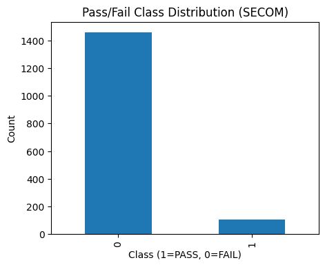

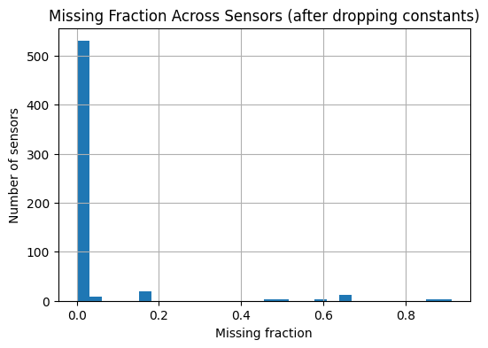

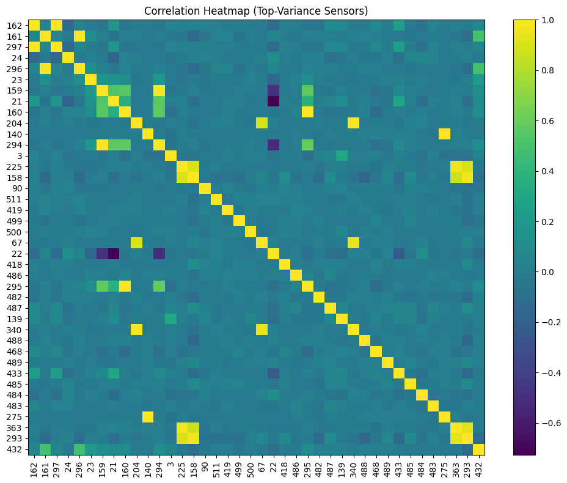
  

**EDA highlights:**
- Severe class imbalance  
- Mostly complete core sensors with conditional diagnostics  
- Strong subsystem-level correlations  

---

### 6️⃣ Feature Engineering
- Robust scaling  
- Imputation pipelines  
- Preparation for nonlinear models  

---

### 7️⃣ Modeling
- **Logistic Regression** – baseline, interpretable  
- **Random Forest** – nonlinear, subsystem-aware  

---

### 8️⃣ Model Evaluation

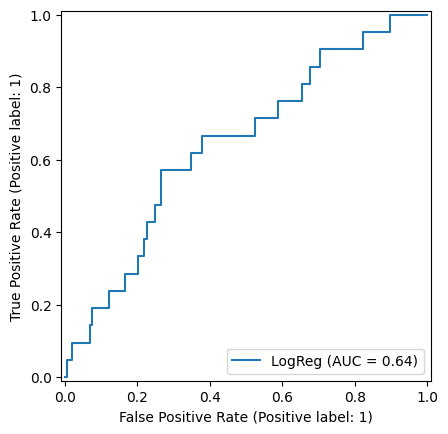

| Model | ROC-AUC |
|-----|--------|
| Logistic Regression | ~0.64 |
| Random Forest | ~0.78 |

**Interpretation**
- Yield risk is **not linearly separable**
- Nonlinear interactions between tool subsystems dominate
- Ensemble models better capture lithography behavior

---

### 9️⃣ Operational Insight: Confusion Matrix

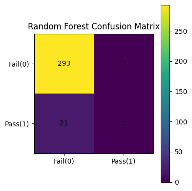
  

At default thresholds, the Random Forest behaves **conservatively**, flagging nearly all runs as FAIL.

  **Prediction ≠ Decision**  
> Threshold tuning is essential to balance **yield protection vs throughput**.

---

## 🔍 Explainability & Root-Cause Insight

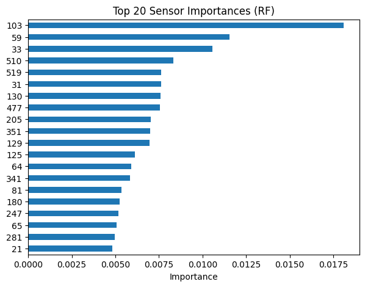

**Key observations:**
- Only **~10–20 sensors dominate** model decisions  
- Reflect real lithography subsystems:
  - Illumination stability  
  - Focus control  
  - Thermal regulation  
  - Stage dynamics  

---

## 📡 Deployment & Drift Monitoring

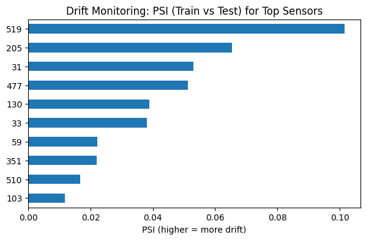

- Drift monitored using **Population Stability Index (PSI)**
- Early-stage drift detected in key sensors
- No catastrophic shifts, but signals of:
  - Tool aging
  - Process change
  - Recipe evolution  

> This mirrors how fabs monitor equipment health in production.

---

## 🚀 Why This Project Stands Out

✔ Real semiconductor manufacturing data  
✔ High-dimensional, imbalanced industrial ML problem  
✔ Strong focus on explainability and deployment readiness  
✔ Direct relevance to **AI chip production and advanced nodes**

---

## 📌 Future Enhancements
- Threshold optimization for fab decision policies  
- Precision-Recall analysis  
- Risk banding (Green / Yellow / Red)  
- SHAP-based local explanations  
- Dashboard integration (Power BI / Plotly Dash)

---

### 📁 Project Files

📓 Photolithography_Project.ipynb

---

# Project 4: Reliability Analysis & Survival Modeling

### Kaplan–Meier, Hazard Functions, and Batch Comparison

---

## 📌 Project Overview

This project focuses on reliability engineering and time-to-event analysis using survival analysis techniques. The objective is to model failure behavior over time, quantify survival probabilities, and compare reliability performance across manufacturing batches.

The analysis applies industry-standard statistical methods widely used in manufacturing, aerospace, defense, and semiconductor reliability studies.

---

## 🎯 Objectives

- Model time-to-failure behavior using Kaplan–Meier survival estimation

- Distinguish failure vs. censored observations

- Compare survival performance between Batch A and Batch B

- Analyze hazard (failure) rates over time

- Support data-driven reliability and quality decisions

---

## 🧠 Methods & Techniques

- Kaplan–Meier Estimator

- Censoring analysis

- Survival curve comparison by group

- Hazard function estimation

- Exploratory distribution analysis

- Confidence interval visualization

---

## 📊 Key Visualizations & Insights

### 1️⃣ Kaplan–Meier Survival Curve

This plot estimates the probability that a unit survives beyond a given time.

Steep early decline indicates early-life failures

Gradual tail suggests wear-out behavior

Confidence bands show estimation uncertainty over time

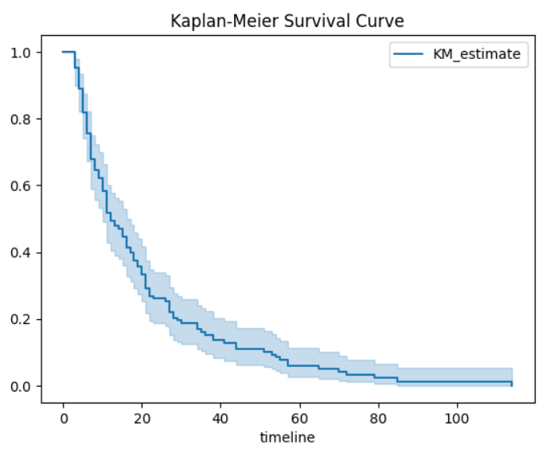

---

### 2️⃣ Time-to-Event Distribution (Failure vs. Censored)

This visualization contrasts observed failures against censored observations.

Failures dominate early time periods

Censored observations increase at later times

Confirms the need for survival modeling vs. simple averages

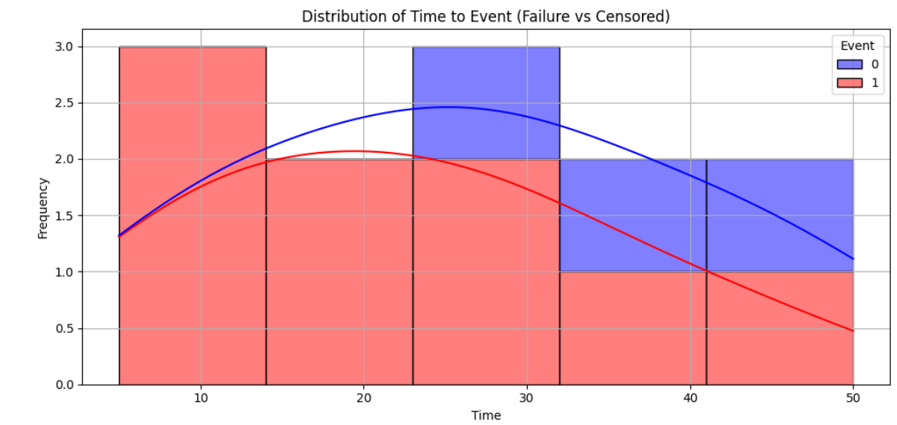

---

### 3️⃣ Survival Probability Comparison (Batch A vs. Batch B)

This comparison highlights reliability differences between manufacturing batches.

Batch A demonstrates consistently higher survival probability

Batch B experiences earlier degradation

Confidence intervals reflect statistical uncertainty

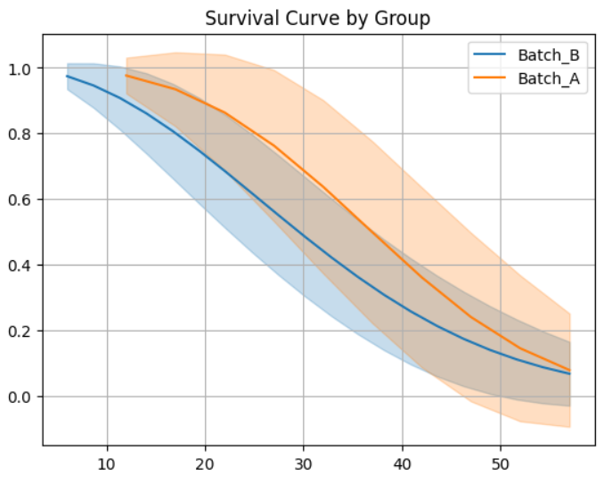

---

### 4️⃣ Smoothed Survival Trends

Smoothed curves help reveal underlying reliability trends.

Batch A shows delayed failure onset

Batch B exhibits faster reliability decay

Useful for management-level interpretation

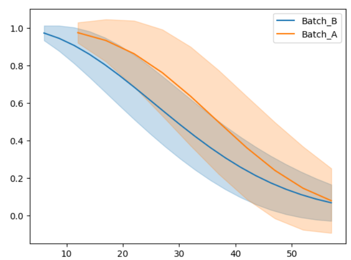

---

### 5️⃣ Hazard Function Analysis

The hazard function represents the instantaneous failure rate.

Increasing hazard rate indicates aging or wear-out failure mode

Critical for maintenance planning and lifecycle decisions

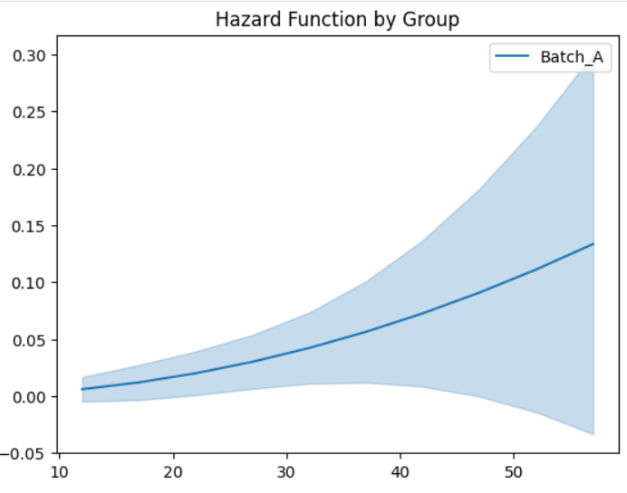

---

## 📈 Business & Engineering Impact

- Enables predictive maintenance strategies

- Supports supplier and batch qualification

- Reduces unexpected failures and downtime

- Improves manufacturing reliability and quality control

- Applicable to aerospace, defense, electronics, and semiconductor systems

---

## 🛠 Tools & Technologies

- Python

- NumPy, Pandas

- Matplotlib / Seaborn

- Lifelines (Survival Analysis)

- Jupyter Notebook
  
---

📁 Notebook:
Reliability Analysis Using Weibull Modeling.ipynb

---

### 🔍 Key Takeaway

Survival analysis provides a statistically robust framework to evaluate reliability, account for censored data, and compare manufacturing performance across batches—far beyond traditional MTBF metrics.

---

# 📊 Project 5: Oath–Outcome Alignment Analysis  
### *From Constitutional Promises to Measurable Outcomes*

---

## 📌 Project Overview

This project applies **data science, statistical modeling, and natural language processing (NLP)** to evaluate whether real-world institutional outcomes align with the **constitutional obligations defined in official government oaths**.

Public institutions in the United States—**military, law enforcement, judiciary, and civil government**—derive their authority from oaths sworn to the U.S. Constitution. While these oaths establish clear legal and ethical obligations, there is limited **quantitative research** measuring how closely institutional behavior aligns with those commitments.

This project addresses that gap by converting **normative legal principles into measurable signals** and comparing them against observed institutional outcomes.

---

## 🎯 Research Question

**Do institutional outcomes align with the constitutional obligations defined in official oaths?**

---

## 🧠 Why This Matters

- Converts normative constitutional law into **quantifiable metrics**
- Bridges **law, ethics, governance, and data science**
- Moves beyond anecdotal accountability toward **evidence-based oversight**
- Rarely studied quantitatively in academic or policy literature

**Relevant to:**
- Oversight bodies  
- Inspectors General  
- Civil rights organizations  
- Policy analysts  
- Academic researchers  

---

## 📊 Key Visualizations

### 🔵 Oath vs Outcome Radar Chart (Law Enforcement Example)

### 🔵 Oath vs Outcome Radar Chart


**Interpretation**
- Large gaps between oath commitments and outcomes indicate **institutional misalignment**
- Collapsed outcome area signals **enforcement or accountability failure**
- Symmetry would indicate constitutional compliance

---

### 📉 Distribution of OOAS Across Agencies


**Insight**
- Left-skewed distributions highlight **systemic negative alignment**
- Outliers identify institutions requiring immediate oversight attention

---

### 🔥 OOAS Heatmap by Agency & State


**Insight**
- Enables **cross-jurisdictional comparison**
- Reveals geographic and institutional accountability disparities

---

## 🔬 Methodology

**Text Analysis (NLP)**
- Oath language extraction
- Constraint density and clarity scoring

**Feature Engineering**
- Accountability strength
- Power–constraint ratios

**Statistical Modeling**
- Regression analysis
- Institutional comparison

**Visualization**
- Radar charts  
- Heatmaps  
- Trend analysis  
---

## 📊 Project 6: Data Center Insights with Data Science & Engineering

### *Operational Intelligence, Reliability, and Performance Optimization*

---

## 📌 Project Overview

This project applies **data science methods grounded in engineering principles** to analyze and interpret **data center operational behavior**, focusing on **thermal stability, energy consumption, and communication efficiency**.

Modern data centers function as tightly coupled cyber-physical systems. Small deviations in temperature, power usage, or communication latency can propagate into **equipment stress, efficiency loss, or reliability risk**. This project demonstrates how **engineering-aware analytics** can support **proactive monitoring and decision-making**.

---

## 🎯 Analytical Objectives

* Monitor and interpret **thermal system behavior**
* Evaluate **power consumption patterns** over operational cycles
* Compare **communication latency** across physical transmission media
* Translate engineering signals into **data-driven operational insights**

---

## 📈 Key Visual Analyses

### 🌡️ Reactor / Equipment Temperature Monitoring (24-Hour Cycle)


**Insight**

* Shows diurnal temperature variation and peak thermal loading
* Dashed threshold highlights **risk zones** requiring alerts or control actions
* Demonstrates how time-series monitoring supports **preventive intervention**
* Directly applicable to **thermal management of racks, cooling loops, and DAHUs**

---

### ⚡ Power Consumption Patterns in a Data Center


**Insight**

* Captures cyclical load behavior across a 24-hour operational window
* Peak demand periods correlate with increased cooling and compute activity
* Supports:

  * Energy efficiency optimization
  * Capacity planning
  * PUE-oriented performance analysis

---

### 🚀 Communication Latency: Optical vs Electrical Transmission


**Insight**

* Quantifies latency growth as a function of distance
* Demonstrates superior scalability of **optical fiber** for low-latency environments
* Reinforces engineering trade-offs in **network design for data centers**
* Relevant to:

  * High-performance computing
  * Low-latency cloud services
  * Backbone infrastructure planning

---

## 🧠 Engineering + Data Science Integration

This project explicitly connects:

* **Physical system behavior** (temperature, power, signal propagation)
* **Data science tools** (EDA, visualization, trend analysis)
* **Engineering constraints** (thresholds, efficiency limits, reliability curves)

Rather than treating data as abstract, each variable is interpreted within its **physical and operational context**.

---

## 🧪 Deliverables

* 📓 Jupyter Notebook with reproducible analysis
* 📊 Engineering-driven visual analytics
* 🧠 Operational insights for infrastructure optimization
* 📘 Documentation linking analytics to real data center systems

---

## 🚀 Future Extensions

* Predictive maintenance models (thermal & electrical)
* Time-series forecasting of energy demand
* Anomaly detection for early fault identification
* Integration with real sensor telemetry (IoT / BMS / EPMS)

---

## 📁 Project Files

📓 The Data Center insights with Data science and engineering (1).ipynb

---

## 📡 Project 7: Wi-Fi Optimization & Communication Performance Analysis

### *Signal Quality, Reliability, and Network Efficiency*

---

## 📌 Project Overview

This project applies **data science, signal processing concepts, and network engineering principles** to analyze **wireless communication performance**, with a focus on **signal reliability, coverage quality, and user-level optimization**.

Wireless networks are fundamental to modern digital infrastructure, yet their performance is constrained by **noise, interference, distance, and infrastructure placement**. This project demonstrates how **engineering-informed analytics** can be used to evaluate and optimize Wi-Fi performance using **quantitative signal metrics**.

---

## 🎯 Analytical Objectives

* Quantify the relationship between **Signal-to-Noise Ratio (SNR)** and **Bit Error Rate (BER)**
* Analyze **spatial Wi-Fi coverage quality** across a service area
* Evaluate **user-level throughput optimization** under SNR constraints
* Support data-driven decisions for **access-point placement and network tuning**

---

## 📈 Key Visual Analyses

### 📉 Bit Error Rate vs Signal-to-Noise Ratio (QPSK)


**Insight**

* Demonstrates the exponential reduction in **bit errors** as SNR increases
* Highlights the reliability threshold required for stable digital communication
* Reinforces theoretical expectations from **digital modulation and communication theory**
* Relevant to network design, error control, and quality-of-service planning

---

### 🗺️ Wi-Fi Coverage Map: Average SNR by Region


**Insight**

* Visualizes spatial variation in **signal quality**
* Identifies low-SNR regions requiring infrastructure improvement
* Supports **access-point optimization** and coverage gap detection
* Applicable to enterprise networks, campuses, and data center environments

---

### 🚀 User Optimization: SNR vs Throughput


**Insight**

* Shows throughput sensitivity to SNR degradation
* Threshold lines highlight **performance drop-off zones**
* Enables classification of **low-quality user experiences**
* Supports intelligent AP assignment and load balancing strategies

---

## 🧠 Engineering & Data Science Integration

This project integrates:

* **Communication theory** (SNR, BER, modulation efficiency)
* **Statistical visualization and analysis**
* **Network performance engineering**
* **Optimization logic** grounded in real-world constraints

Each result is interpreted in the context of **physical signal behavior and network performance limits**.

---

## 🧪 Deliverables

* 📓 Jupyter Notebook with reproducible simulations
* 📊 Communication performance visualizations
* 📡 Network optimization insights
* 📘 Engineering-aware documentation

---

## 🚀 Future Enhancements

* Adaptive modulation and coding analysis
* Machine-learning-based AP selection
* Time-varying interference modeling
* Integration with real Wi-Fi telemetry data

---

## 📁 Project Files

📓 Wifi optimization (1).ipynb

---

## 👤 Author

**Jemael Nzihou**
PhD Student — Data Science 
Chemical Engineer | Business Analytics | Quality Champion certified  
🔗 Portfolio: https://jemaelnzihou.github.io/Jemael-Nzihou-Portfolio/  
🔗 LinkedIn: https://www.linkedin.com/in/jemaelnzihou

[](https://www.credential.net/e04c82b4-44d7-4315-8131-e6c3873e5143#acc.mToFZaKE) 

[](https://www.coursera.org/account/accomplishments/professional-cert/KAR555JBRMQD)

[](https://www.coursera.org/account/accomplishments/professional-cert/A993OS5I15RU)

[](https://www.coursera.org/account/accomplishments/professional-cert/6XQJN95NRRB2)

---

## 📜 License

This project is released for **research and educational use**.
Please cite appropriately if used in academic or policy work.

